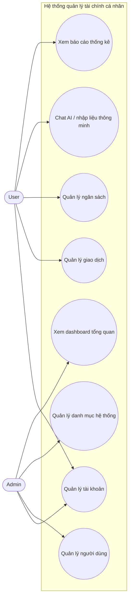
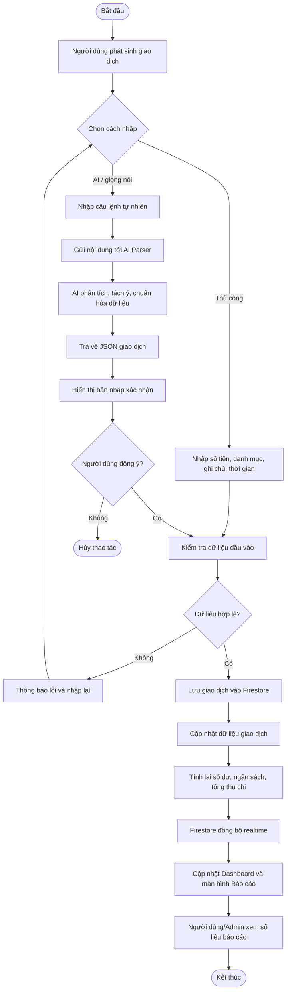

# Sơ đồ và bảng đặc tả yêu cầu chức năng

## 1. Sơ đồ use case tổng quát

## 2. Sơ đồ activity nghiệp vụ tổng quát

## 3. Bảng đặc tả yêu cầu chức năng

### 3.1. Phân hệ User

| Mã CN | Tên chức năng | Mô tả | Dữ liệu vào | Kết quả / đầu ra |
|---|---|---|---|---|
| U01 | Đăng ký tài khoản | Người dùng tạo tài khoản mới bằng email và mật khẩu | Email, mật khẩu, tên hiển thị | Tài khoản được tạo, hồ sơ người dùng được khởi tạo |
| U02 | Đăng nhập | Người dùng đăng nhập vào hệ thống | Email, mật khẩu | Truy cập vào ứng dụng nếu hợp lệ |
| U03 | Quên / đặt lại mật khẩu | Người dùng yêu cầu khôi phục mật khẩu | Email hoặc OTP xác thực | Mật khẩu được đặt lại thành công |
| U04 | Cập nhật hồ sơ cá nhân | Sửa tên, ảnh đại diện hoặc thông tin cơ bản | Thông tin hồ sơ mới | Hồ sơ được cập nhật |
| U05 | Thêm giao dịch thủ công | Nhập trực tiếp khoản thu/chi | Số tiền, loại giao dịch, danh mục, ngày, ghi chú | Giao dịch được lưu vào hệ thống |
| U06 | Thêm giao dịch bằng AI | Nhập câu lệnh tự nhiên hoặc giọng nói để AI tạo giao dịch | Nội dung chat/giọng nói | Danh sách giao dịch nháp và giao dịch được lưu sau xác nhận |
| U07 | Xem lịch sử giao dịch | Tra cứu danh sách giao dịch đã phát sinh | Bộ lọc theo ngày, loại, danh mục | Danh sách giao dịch hiển thị |
| U08 | Sửa / xóa giao dịch | Điều chỉnh hoặc hủy giao dịch đã tạo | Mã giao dịch, thông tin chỉnh sửa | Giao dịch được cập nhật hoặc xóa |
| U09 | Thiết lập ngân sách | Đặt hạn mức chi tiêu theo danh mục và tháng | Danh mục, hạn mức, tháng áp dụng | Bản ghi ngân sách được tạo |
| U10 | Theo dõi cảnh báo ngân sách | Hệ thống cảnh báo khi gần chạm hoặc vượt hạn mức | Dữ liệu giao dịch và ngân sách | Trạng thái xanh/vàng/đỏ được hiển thị |
| U11 | Xem báo cáo thống kê | Xem biểu đồ thu chi theo tháng/năm | Thời gian cần xem, bộ lọc báo cáo | Biểu đồ và số liệu tổng hợp được hiển thị |

### 3.2. Phân hệ Admin

| Mã CN | Tên chức năng | Mô tả | Dữ liệu vào | Kết quả / đầu ra |
|---|---|---|---|---|
| A01 | Đăng nhập Admin | Quản trị viên đăng nhập vào cổng quản trị | Email, mật khẩu | Truy cập trang quản trị nếu đúng quyền |
| A02 | Xem dashboard tổng quan | Theo dõi số lượng người dùng và dòng tiền toàn hệ thống | Không bắt buộc hoặc bộ lọc thời gian | Thống kê tổng quan toàn cục |
| A03 | Xem danh sách người dùng | Hiển thị toàn bộ tài khoản trong hệ thống | Bộ lọc, từ khóa tìm kiếm | Danh sách người dùng |
| A04 | Tìm kiếm người dùng | Tìm user theo tên hoặc email | Từ khóa tìm kiếm | Kết quả user phù hợp |
| A05 | Khóa / mở khóa tài khoản | Thay đổi trạng thái tài khoản người dùng vi phạm hoặc được mở lại | Mã người dùng, trạng thái | Tài khoản được cập nhật trạng thái |
| A06 | Quản lý danh mục hệ thống | Thêm, sửa, xóa danh mục mặc định dùng chung | Tên danh mục, loại, mô tả | Danh mục hệ thống được cập nhật |
| A07 | Xem chi tiết dữ liệu hỗ trợ giám sát | Xem dữ liệu liên quan để phục vụ kiểm tra và hỗ trợ | User cần xem, bộ lọc thời gian | Thông tin chi tiết phục vụ giám sát |

## 4. Hướng dẫn thiết kế bảng đứng trong Word

Nếu giảng viên yêu cầu "bảng đứng", bạn nên trình bày **mỗi chức năng là một bảng riêng**, theo mẫu sau:

| Thuộc tính | Nội dung |
|---|---|
| Mã chức năng | U05 |
| Tên chức năng | Thêm giao dịch thủ công |
| Tác nhân | User |
| Mô tả | Người dùng nhập và lưu một khoản thu hoặc chi |
| Điều kiện trước | Người dùng đã đăng nhập |
| Luồng chính | 1. Mở màn hình thêm giao dịch. 2. Nhập thông tin. 3. Hệ thống kiểm tra hợp lệ. 4. Hệ thống lưu dữ liệu |
| Luồng thay thế | Dữ liệu không hợp lệ thì báo lỗi và yêu cầu nhập lại |
| Dữ liệu vào | Số tiền, loại giao dịch, danh mục, ngày, ghi chú |
| Dữ liệu ra | Giao dịch mới được lưu, dashboard cập nhật |
| Điều kiện sau | Giao dịch xuất hiện trong lịch sử và báo cáo |

### Gợi ý trình bày đẹp

1. Mỗi chức năng một bảng riêng, tiêu đề dạng: **Bảng x.x. Đặc tả chức năng U05 - Thêm giao dịch thủ công**.
2. Cột trái giữ cố định khoảng 3.5 cm đến 4 cm, cột phải để rộng hơn.
3. Dùng chữ in đậm cho tên thuộc tính ở cột trái.
4. Căn giữa tiêu đề bảng, còn nội dung bảng căn trái.
5. Với luận văn/báo cáo, nên đặt các bảng User trước, sau đó đến các bảng Admin.
